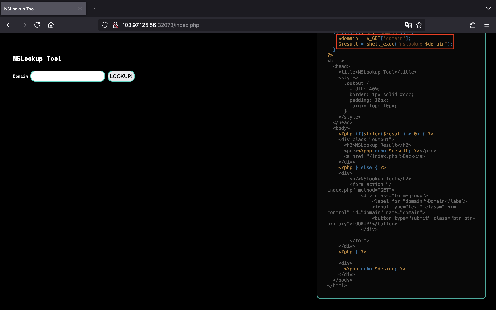
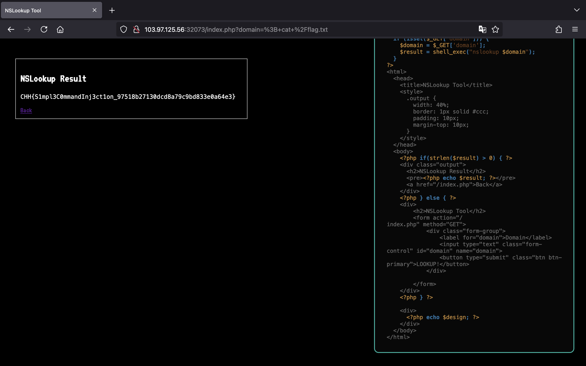
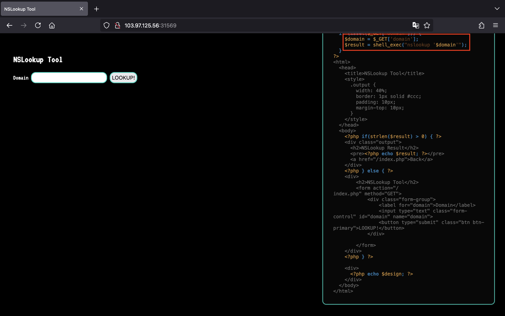
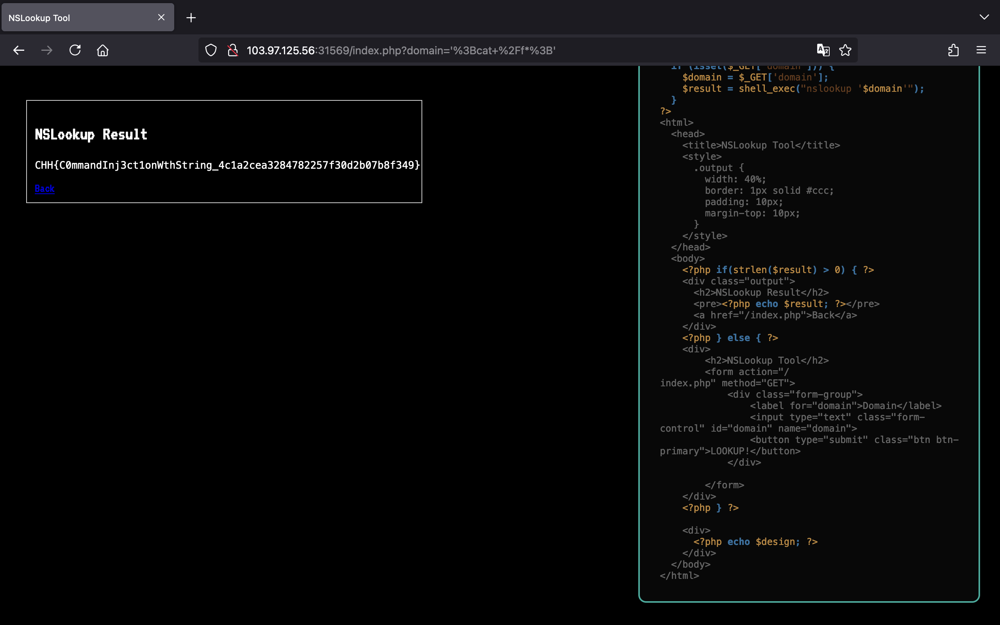

<!-- markdownlint-disable MD033 MD041 -->

<!-- markdownlint-enable MD033 -->

# Cookie Arena

Chào mọi người!

Ở repo này, mình sẽ viết lại những cách mà mình đã thực hiện để có thể giải được một số thử thách thuộc mảng Web trên trang [Cookie Arena](https://battle.cookiearena.org/).

Bắt đầu nào! 🔥

## NSLookup (Level 1)

> Challenge này cung cấp một công cụ tra cứu DNS (Domain Name System) đơn giản, cho phép người dùng nhập tên miền (domain) vào ô nhập liệu, và chương trình sẽ trả về kết quả của lệnh nslookup. Đây là một ví dụ cho lỗ hổng OS Command Injection, nơi đầu vào không được kiểm tra đúng cách, cho phép thực thi các lệnh hệ thống ngoài ý muốn.
>
> **Cách hoạt động**:
>
> - Người dùng nhập tên miền vào biểu mẫu (form).
> - Tên miền được xử lý và truyền vào lệnh nslookup thông qua shell_exec().
> - Kết quả được hiển thị lại trong trình duyệt.
>
> **Mục tiêu**: Khai thác lỗ hổng Command Injection để truy cập và đọc nội dung file /flag.txt trên máy chủ.
>
> **Nhiệm vụ**:
>
> - Tìm cách chèn lệnh độc hại thông qua trường nhập domain.
> - Kích hoạt thực thi lệnh tùy ý trên máy chủ để trích xuất nội dung file flag.txt.

Mô tả của thử thách cũng đã rất rõ ràng, đây là một trang web được viết bằng PHP dính lỗ hổng OS Command Injection.

Chúng ta có thể thấy, dữ liệu đầu vào qua tham số `domain` lấy từ URL không được xử lý mà được truyền thằng vào hàm `shell_exec()`, cho phép chúng ta thực thi lệnh hệ thống tuỳ ý.

Do `domain` truyền vào phía sau lệnh `nslookup` nên chúng ta sẽ kết hợp sử dụng dấu `;` để thực thi một loạt các lệnh.

Nhập vào payload `; ls /`, chúng ta xác định được có file `flag.txt` nằm tại `/`.

Để đọc flag, chúng ta dùng payload `; cat /flag.txt`.

## NSLookup (Level 2)

> Challenge này cung cấp một công cụ tra cứu DNS (Domain Name System) đơn giản, cho phép người dùng nhập tên miền (domain) vào ô nhập liệu, và chương trình sẽ trả về kết quả của lệnh nslookup. Đây là một ví dụ cho lỗ hổng OS Command Injection, nơi đầu vào không được kiểm tra đúng cách, cho phép thực thi các lệnh hệ thống ngoài ý muốn.
>
> **Cách hoạt động**:
>
> Người dùng nhập tên miền vào biểu mẫu (form).
> Tên miền được xử lý và truyền vào lệnh nslookup thông qua shell_exec().
> Kết quả được hiển thị lại trong trình duyệt.
>
> **Mục tiêu**: Khai thác lỗ hổng Command Injection để truy cập và đọc nội dung file /flag.txt trên máy chủ.
>
> **Nhiệm vụ**:
>
> Tìm cách chèn lệnh độc hại thông qua trường nhập domain.
> Kích hoạt thực thi lệnh tùy ý trên máy chủ để trích xuất nội dung file flag.txt.

Đến với level 2 này, lập trình viên đã đưa giá trị của tham số `domain` vào trong cặp dấu nháy `''`.

Như vậy, chúng ta cần phải escape khỏi cặp dấu đó mới có thể thực thi được lệnh tuỳ ý.

Chúng ta có thể sử dụng payload ngắn gọn như `';cat /f*;'` để lấy flag. Ở payload này sử dụng wildcard `*` để khớp với tất cả các ký tự, nó rất hữu ích trong những trường hợp mà chúng ta không biết tên file.

